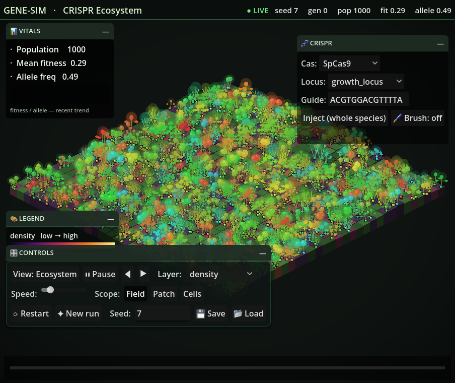

# gene-sim

> A 2D CRISPR ecosystem simulator — a deterministic, headless Rust core with a Godot renderer.



Set a world — GPS latitude/longitude, climate, season, seed — then watch natural selection
reshape a population in real time, and steer evolution with a **CRISPR brush**. Every run is
bit-for-bit reproducible from its master seed.

## Features

- **Deterministic core** — one master seed drives everything (`ChaCha8` RNG, no transcendentals in sim math); same seed + build + platform → identical bytes.
- **Climate + main menu** — GPS lat/lon → sun trajectory (day length, insolation), average temperature and season feed a `ClimateModifier` that shapes selection on a heritable thermal-tolerance trait.
- **CRISPR editing** — on-/off-target scoring sits behind a Rust trait; edit a whole species or paint a region with the selective brush.
- **Spatial ecosystem** — organisms live on a real world grid with soil moisture / nutrients / pH; lineages disperse and cluster into emergent regions.
- **Save / load** — a deterministic action journal resumes a run exactly.
- **Specimen view** — L-system plants drawn from the evolving genome, logged incrementally per edit.

## Download (beta)

Grab an installer from the [latest release](../../releases):

- **Linux** — `gene-sim_*_amd64.deb`
- **Windows** — `gene-sim_*_windows-x86_64.zip` (run `gene-sim.exe`; keep `godot_sim.dll` next to it)

These beta builds are unsigned: on Windows, SmartScreen → **More info → Run anyway**. A macOS `.dmg` is planned once the build is code-signed + notarized.

## Build from source

Requires **Rust 1.96** and **Godot 4.6**.

```bash
# headless core + full test suite (determinism, proptests, license, oracle)
cargo test --workspace

# build the LiveSim native extension, then run the game (open-ended sandbox)
cargo build --release --manifest-path crates/godot-sim/Cargo.toml
godot --path godot --live
```

In the game: drag a panel by its header, minimise panels to the pill rail, `Space` pauses,
`B` toggles the selective CRISPR brush. The full quality gate is `tools/gate.sh`.

## Architecture

Headless-first. **All genotype→phenotype biology lives in the Rust core** (`crates/sim-core`,
`crates/genome`); the Godot renderer is read-only and only displays core-computed snapshots.
SLiM (GPL-3), when used as a genetics oracle, is invoked **only as a separate subprocess** — the
game binary links no GPL code. The full design contract and invariants are in
[docs/llm/SPEC.md](docs/llm/SPEC.md).

## Status

**Beta — `v0.1.0-beta`**, a proof of concept under active development. License TBD.
